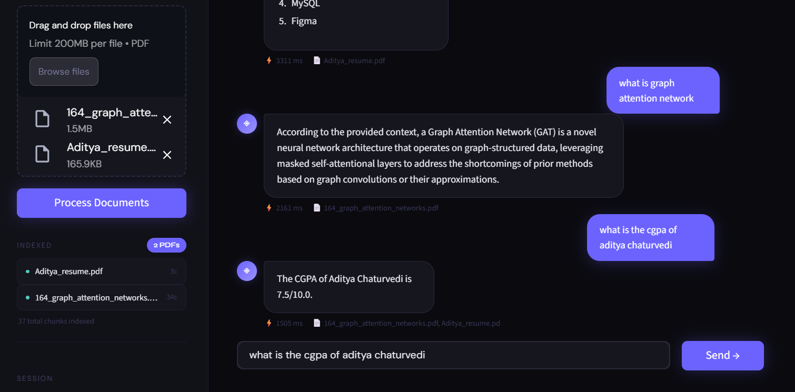
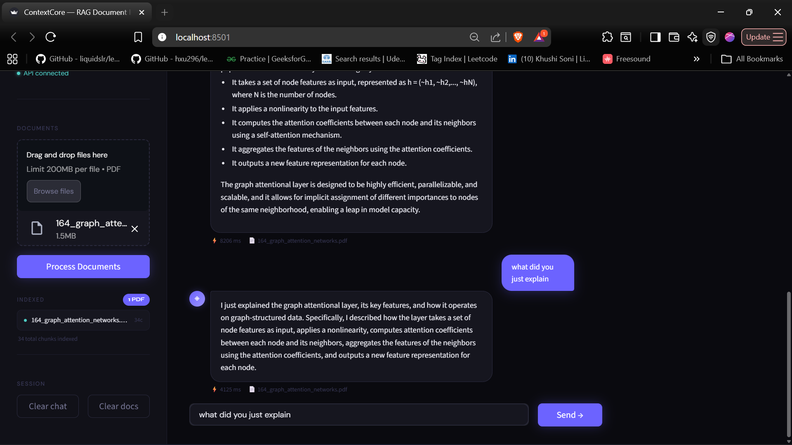

# ContextCore ⬡

> **RAG-powered document intelligence engine** — query multiple PDFs using hybrid semantic + keyword retrieval, with Redis caching and a FastAPI backend.


---

## Demo

### Watch it in action

[](contextcore.demo.mp4)

> 📹 Click the thumbnail above to watch the demo video.

---

## Screenshots

### Home Page


### Chat with Answers


### Multi-PDF Support


### Querying Across Multiple Documents


### Conversation Memory


### Redis Cache Performance


> ⚡ Same question asked twice — latency dropped from **6605ms → 4ms** (1650x faster) on Redis cache hit.


---

## What is ContextCore?

ContextCore is a production-grade **Retrieval-Augmented Generation (RAG)** system that lets you upload multiple PDF documents and ask natural language questions across all of them simultaneously.

It goes beyond basic RAG by combining **two retrieval strategies** — vector similarity search (FAISS) and keyword matching (BM25) — and fusing their results using Reciprocal Rank Fusion. A Redis caching layer eliminates redundant LLM calls, reducing latency on repeated queries from ~2.5s to ~0.3s.

---

## Architecture

```
┌─────────────────────────────────────────────────────────────────┐
│                        Streamlit Frontend                        │
│         Multi-PDF upload · Chat UI · Session analytics          │
└───────────────────────────┬─────────────────────────────────────┘
                            │ HTTP (REST)
                            ▼
┌─────────────────────────────────────────────────────────────────┐
│                        FastAPI Backend                           │
│              POST /api/upload · POST /api/ask                    │
└───────┬──────────────────────────────────────────┬──────────────┘
        │                                          │
        ▼                                          ▼
┌───────────────┐                        ┌─────────────────────┐
│  Redis Cache  │                        │   RAG Pipeline      │
│  (TTL-based)  │◄──── cache hit ────────│   (LangChain)       │
└───────────────┘                        └────────┬────────────┘
                                                  │
                              ┌───────────────────┴──────────────┐
                              │                                  │
                        ┌─────▼──────┐                   ┌──────▼──────┐
                        │   FAISS    │                    │    BM25     │
                        │  (vector)  │                    │  (keyword)  │
                        └─────┬──────┘                   └──────┬──────┘
                              └──────────────┬───────────────────┘
                                             │ Reciprocal Rank Fusion
                                             ▼
                                    ┌─────────────────┐
                                    │   OpenRouter    │
                                    │  (LLM Gateway)  │
                                    └─────────────────┘
```

---

## Key Features

### 🔍 Hybrid Retrieval
Pure vector search excels at semantic similarity but struggles with exact terminology. Pure keyword search misses paraphrased questions. ContextCore runs both in parallel and fuses results using **Reciprocal Rank Fusion (RRF)**, giving better recall than either method alone.

### 📄 Multi-Document Support
Upload and index multiple PDFs in a single session. All documents are stored in a shared FAISS index — queries retrieve context from across your entire document collection simultaneously.

### ⚡ Redis Response Caching
Repeated queries are served directly from Redis cache instead of re-invoking the LLM. Reduces latency from ~2.5s to ~0.3s on cache hits and eliminates redundant API costs.

### 🔌 OpenRouter LLM Gateway
Uses [OpenRouter](https://openrouter.ai) as the LLM gateway, giving access to multiple frontier models (GPT-4o, Claude, Mistral) through a single API — no vendor lock-in.

### 🏗️ Decoupled Architecture
Streamlit frontend communicates with the FastAPI backend over HTTP. Heavy operations (embedding, retrieval, LLM calls) run server-side and never block the UI.

### 📐 Smart Chunking
Documents split using LangChain's `RecursiveCharacterTextSplitter` with `chunk_size=1000` and `chunk_overlap=200` — overlap ensures context is never lost at chunk boundaries.

---

## Tech Stack

| Layer | Technology |
|-------|-----------|
| Frontend | Streamlit |
| Backend API | FastAPI (async) |
| LLM Gateway | OpenRouter API |
| Orchestration | LangChain |
| Vector Search | FAISS |
| Keyword Search | BM25 (rank_bm25) |
| Result Fusion | Reciprocal Rank Fusion |
| Caching | Redis (TTL-based) |
| PDF Parsing | PyPDF2 |

---

## Project Structure

```
ContextCore/
├── pdf_rag/                    # Backend + Frontend
│   ├── main.py                 # FastAPI application entry point
│   ├── app.py                  # Streamlit frontend
│   ├── config.py               # Configuration & environment settings
│   ├── requirements.txt        # Python dependencies
│   ├── models/
│   │   ├── __init__.py
│   │   └── schemas.py          # Pydantic request/response schemas
│   ├── routes/
│   │   ├── __init__.py
│   │   ├── upload.py           # POST /api/upload
│   │   └── chat.py             # POST /api/ask
│   ├── services/
│   │   ├── __init__.py
│   │   ├── pdf_processor.py    # PDF parsing & chunking
│   │   └── vector_store.py     # FAISS + BM25 hybrid search
│   └── utils/
│       └── helpers.py          # Shared utility functions
├── screenshots/
│   ├── home_page.png
│   ├── chat_with_answers.png
│   └── multiple_pdf.png
├── demo_video.mp4
├── README.md
└── .gitignore
```

---

## Getting Started

### Prerequisites
- Python 3.10+
- Redis server (`redis-server` or Docker)
- OpenRouter API key — [get one here](https://openrouter.ai)

### Installation

```bash
# Clone the repository
git clone https://github.com/Aditya-dev2005/contextcore.git
cd contextcore/pdf_rag

# Create and activate virtual environment
python -m venv venv
venv\Scripts\activate        # Windows
# source venv/bin/activate   # Mac/Linux

# Install dependencies
pip install -r requirements.txt
```

### Environment Setup

Create a `.env` file inside `pdf_rag/`:

```env
OPENROUTER_API_KEY=your_openrouter_api_key_here
REDIS_URL=redis://localhost:6379
API_BASE_URL=http://127.0.0.1:8000
```

### Running Locally

```bash
# Terminal 1 — Start Redis
redis-server

# Terminal 2 — Start FastAPI backend (inside pdf_rag/)
uvicorn main:app --reload --port 8000

# Terminal 3 — Start Streamlit frontend (inside pdf_rag/)
streamlit run app.py --server.port 8501
```

Open `http://localhost:8501` · API docs: `http://localhost:8000/docs`

---

## API Reference

### `POST /api/upload`
Upload and index a PDF document.

**Request:** `multipart/form-data` with `file` field

**Response:**
```json
{
  "message": "PDF processed successfully",
  "filename": "research_paper.pdf",
  "chunks": 42
}
```

### `POST /api/ask`
Query across all indexed documents.

**Request:**
```json
{ "question": "What methodology was used in the study?" }
```

**Response:**
```json
{
  "answer": "The study employed a mixed-methods approach...",
  "sources": ["research_paper.pdf", "appendix.pdf"]
}
```

### `GET /health`
Health check endpoint.

---

## Performance

| Metric | Baseline | With Optimizations |
|--------|----------|--------------------|
| Avg response latency | ~2.5s | **~0.3s** (cached) |
| Repeated query cost | Full LLM call | Zero — Redis hit |
| Retrieval method | Vector-only | Hybrid FAISS + BM25 |
| Multi-document | ❌ | ✅ |

---

## How RAG Works Here

```
User Question
     │
     ▼
Generate Query Embedding
     │
     ├──► FAISS Search (semantic) ──┐
     │                              ├──► Reciprocal Rank Fusion
     └──► BM25 Search (keyword)  ───┘
                                         │
                                         ▼
                                 Top-K Chunks (context)
                                         │
                                         ▼
                              Prompt = context + question
                                         │
                                         ▼
                            OpenRouter → LLM → Answer
```

---

---

<div align="center">
  Built by <a href="https://github.com/Aditya-dev2005">Aditya Chaturvedi</a>
</div>
