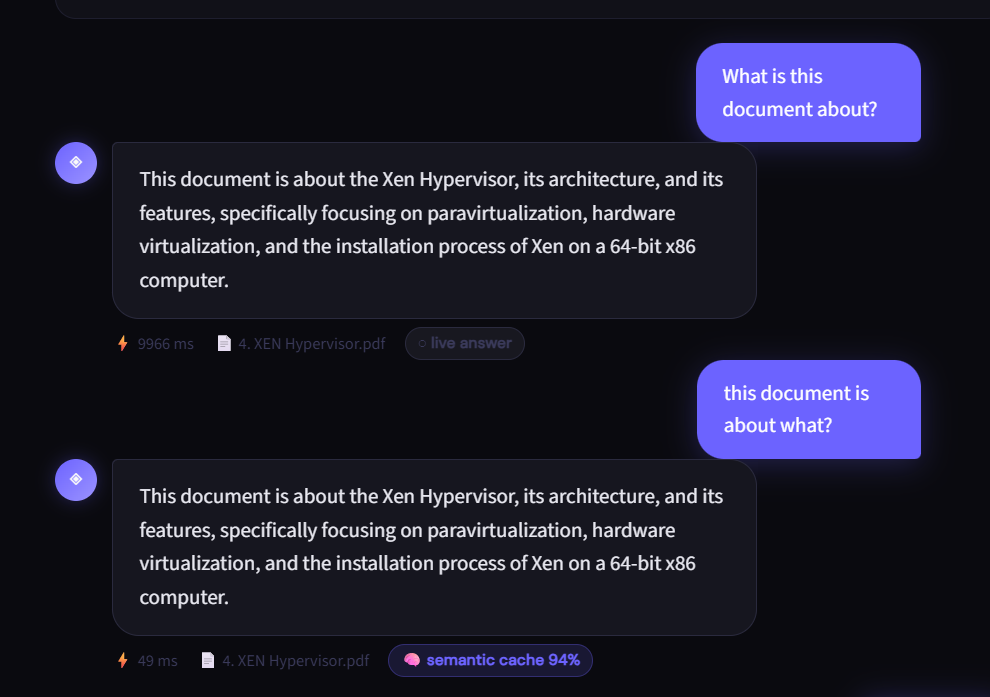
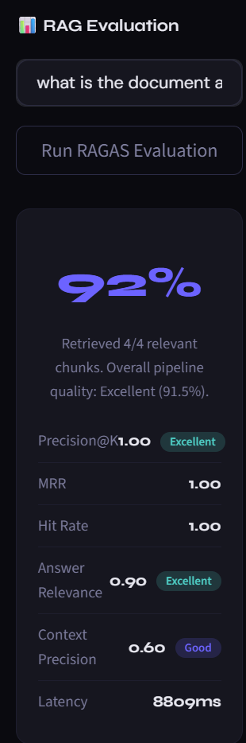

# ContextCore ⬡

> **RAG-powered document intelligence engine** — query multiple PDFs using hybrid semantic + keyword retrieval, with JWT auth, real-time streaming, semantic caching, automated RAG evaluation, and session history.


---

## Live Demo

- **Frontend:** [https://contextcore-y7kzygpxf4wtqbhrch9jak.streamlit.app/](https://contextcore-production-5e9c.up.railway.app/)
- **Backend API:** contextcore-production-673f.up.railway.app
- **API Docs:** https://contextcore-production-bb70.up.railway.app/docs

---

## Video Demo

### Watch it in action

[](contextcore.demo.mp4)

> 📹 Click the thumbnail above to watch the demo video.

---

## Screenshots

| Home Page | Chat with Answers |
|-----------|------------------|
|  |  |

| Login Page | Document History |
|------------|------------------|
|  |  |

| Multi-PDF Support | Redis Cache Hit |
|------------------|-----------------|
|  |  |

| Semantic Cache (Paraphrase Match) | RAGAS Evaluation Panel |
|-----------------------------------|------------------------|
|  |  |

> ⚡ Same question asked twice — latency dropped from **6605ms → 4ms** (1650x faster) on cache hit.
> ⚡ Paraphrased question ("What is this document about?" vs "This document is about what") — still hits cache via **semantic similarity matching**, not just exact text match.
> 📊 RAGAS-style evaluation panel scores retrieval and answer quality live — Precision@K, MRR, Hit Rate, Answer Relevance, Context Precision — with an overall weighted score.

---

## What is ContextCore?

ContextCore is a production-grade **Retrieval-Augmented Generation (RAG)** system that lets you upload multiple PDF documents and ask natural language questions across all of them simultaneously.

It goes beyond basic RAG by combining **two retrieval strategies** — vector similarity search (FAISS) and keyword matching (BM25) — fused via Reciprocal Rank Fusion. Responses stream token-by-token like ChatGPT. A **two-level semantic caching layer** eliminates redundant LLM calls for both exact and paraphrased repeat questions. An **automated RAGAS-style evaluation pipeline** quantifies retrieval and answer quality using LLM-as-judge scoring. JWT authentication gives each user an isolated private document space. Session history lets you save and reload any past conversation.

---

## Architecture

```
┌─────────────────────────────────────────────────────────────────┐
│                    Streamlit Frontend (app.py)                   │
│     JWT Login · Multi-PDF upload · Streaming Chat UI            │
│     Session History · Per-user document space                    │
└───────────────────────────┬─────────────────────────────────────┘
                            │ HTTP (REST + SSE streaming)
                            ▼
┌─────────────────────────────────────────────────────────────────┐
│                        FastAPI Backend                           │
│  POST /api/auth/signup   POST /api/auth/login   (JWT)           │
│  POST /api/upload        POST /api/ask                           │
│  POST /api/stream        POST /api/evaluate                      │
│  GET  /health                                                    │
└───────┬──────────────────────────────────────┬──────────────────┘
        │                                      │
        ▼                                      ▼
┌─────────────────────┐              ┌─────────────────────┐
│  Semantic Cache       │              │   RAG Pipeline       │
│  ┌─────────────────┐ │◄── hit ──────│   (LangChain)        │
│  │ Exact match       │ │              └────────┬─────────────┘
│  │ (MD5 hash)         │ │                       │
│  ├─────────────────┤ │         ┌───────────────┴──────────────┐
│  │ Semantic match     │ │         │                              │
│  │ (cosine sim ≥0.92) │ │   ┌─────▼──────┐               ┌──────▼──────┐
│  └─────────────────┘ │   │   FAISS    │                │    BM25     │
│  Per-user, TTL-based  │   │  (vector)  │                │  (keyword)  │
└──────────────────────┘   └─────┬──────┘                └──────┬──────┘
                                  └──────────────┬───────────────────┘
                                                  │ Reciprocal Rank Fusion
                                                  ▼
                                         ┌─────────────────┐
                                         │   OpenRouter     │
                                         │  (LLM Gateway)   │
                                         └────────┬─────────┘
                                                  │
                                                  ▼
                                  ┌───────────────────────────────┐
                                  │   RAGAS Evaluator               │
                                  │   (LLM-as-judge)                │
                                  │   Precision@K · MRR · Hit Rate  │
                                  │   Answer Relevance · Ctx Prec.  │
                                  └───────────────────────────────┘
```

---

## Key Features

### 🔐 JWT Authentication
Secure signup/login with bcrypt-hashed passwords and JWT tokens (24hr expiry). Every API request is authenticated — your documents are never accessible to other users.

### 👤 Per-User Document Isolation
Each authenticated user gets their own in-memory FAISS vectorstore. Documents uploaded by one user are completely invisible to others, enforced at the API layer.

### 🌊 Real-Time Streaming Responses
Answers stream token-by-token via Server-Sent Events (SSE) — the same UX as ChatGPT. A blinking cursor shows while the model is generating. Cached answers also stream for consistent UX.

### 🧠 Semantic Caching
A two-level cache: a fast exact-match layer (MD5 hash) checked first, then a semantic layer using `sentence-transformers` embeddings and cosine similarity (threshold 0.92) that catches **paraphrased questions** an exact-match cache would miss entirely — e.g. "What's the leave policy?" and "Tell me about the leave policy" resolve to the same cached answer. Falls back gracefully to exact-match-only if embeddings are unavailable.

### 📊 Automated RAG Evaluation (RAGAS-style)
A dedicated `/api/evaluate` endpoint runs an LLM-as-judge evaluation pipeline implementing the core RAGAS metrics — **Precision@K**, **MRR (Mean Reciprocal Rank)**, **Hit Rate**, **Answer Relevance**, and **Context Precision** — producing a weighted overall quality score with human-readable grading (Excellent / Good / Fair / Poor). Built without the heavyweight `ragas` package, using direct LLM-as-judge prompting for full control over scoring logic and minimal dependency footprint.

### 📚 Session History
Save any conversation with one click. Saved sessions store the full message history and PDF filenames, with timestamps. Load any past session to pick up exactly where you left off.

### 🔍 Hybrid Retrieval
Pure vector search excels at semantic similarity but struggles with exact terminology. Pure keyword search misses paraphrased questions. ContextCore runs both in parallel and fuses results using **Reciprocal Rank Fusion (RRF)**, giving better recall than either method alone.

### 📄 Multi-Document Support
Upload and index multiple PDFs in one session. Queries retrieve context from across your entire document collection simultaneously, with per-chunk source metadata tracking.

### 🔌 OpenRouter LLM Gateway
Uses [OpenRouter](https://openrouter.ai) as the LLM gateway — access GPT-4o, Claude, Mistral, and LLaMA through a single API. No vendor lock-in.

### 🏗️ Decoupled Architecture
Streamlit frontend communicates with FastAPI backend over HTTP. Heavy operations (embedding, retrieval, LLM calls, evaluation) run server-side and never block the UI.

---

## Tech Stack

| Layer | Technology |
|-------|-----------|
| Frontend | Streamlit |
| Backend API | FastAPI (async) |
| Authentication | JWT (PyJWT) + SHA-256 |
| LLM Gateway | OpenRouter API |
| Orchestration | LangChain |
| Vector Search | FAISS |
| Keyword Search | BM25 (rank_bm25) |
| Result Fusion | Reciprocal Rank Fusion |
| Caching | Redis — exact + semantic (sentence-transformers, cosine similarity) |
| Evaluation | Custom RAGAS-style LLM-as-judge (Precision@K, MRR, Hit Rate, Answer Relevance, Context Precision) |
| Streaming | Server-Sent Events (SSE) |
| PDF Parsing | PyPDF2 |
| Session Storage | JSON file (local) |

---

## Project Structure

```
ContextCore/
├── pdf_rag/
│   ├── main.py                     # FastAPI entry point
│   ├── app.py                      # Streamlit frontend
│   ├── config.py                   # Config & env settings
│   ├── requirements.txt
│   ├── models/
│   │   ├── __init__.py
│   │   └── schemas.py              # Pydantic schemas (incl. Evaluate schemas)
│   ├── routes/
│   │   ├── __init__.py
│   │   ├── auth.py                 # POST /api/auth/signup, /login (JWT)
│   │   ├── upload.py               # POST /api/upload (user-scoped)
│   │   ├── chat.py                 # POST /api/ask (semantic cache integrated)
│   │   ├── stream.py               # POST /api/stream (SSE + semantic cache)
│   │   └── evaluate.py             # POST /api/evaluate (RAGAS-style metrics)
│   ├── services/
│   │   ├── __init__.py
│   │   ├── pdf_processor.py        # PDF parsing & chunking
│   │   ├── vector_store.py         # Per-user FAISS + BM25 hybrid search
│   │   ├── cache_service.py        # Redis client wrapper
│   │   ├── semantic_cache.py       # Two-level exact + semantic caching
│   │   ├── evaluation_service.py   # RAGASEvaluator — LLM-as-judge metrics
│   │   ├── user_service.py         # User storage & password hashing
│   │   └── history_service.py      # Session save/load/delete (JSON)
│   └── utils/
│       └── helpers.py
├── screenshots/
├── demo_video.mp4
├── README.md
└── .gitignore
```

---

## Getting Started

### Prerequisites
- Python 3.10+
- Redis server (optional — app works without it, falls back gracefully)
- OpenRouter API key — [get one here](https://openrouter.ai)

### Installation

```bash
git clone https://github.com/Aditya-dev2005/contextcore.git
cd contextcore/pdf_rag

python -m venv venv
venv\Scripts\activate        # Windows
# source venv/bin/activate   # Mac/Linux

pip install -r requirements.txt
```

> Note: `sentence-transformers` (for semantic caching) downloads the `all-MiniLM-L6-v2` model (~80MB) on first use. It's lazy-loaded, so server startup is not blocked.

### Environment Setup

Create a `.env` file inside `pdf_rag/`:

```env
OPENROUTER_API_KEY=your_openrouter_api_key_here
REDIS_HOST=localhost
REDIS_PORT=6379
REDIS_PASSWORD=
REDIS_DB=0
REDIS_TTL=3600
JWT_SECRET=your-secret-key-here
API_BASE_URL=http://127.0.0.1:8000
```

### Running Locally

```bash
# Terminal 1 — FastAPI backend
uvicorn main:app --reload --port 8001

# Terminal 2 — Streamlit frontend
streamlit run app.py
```

Open `http://localhost:8501` · API docs: `http://localhost:8001/docs`

---

## API Reference

### Auth

#### `POST /api/auth/signup`
```json
{ "username": "aditya", "password": "mypassword" }
```
Returns JWT token.

#### `POST /api/auth/login`
```json
{ "username": "aditya", "password": "mypassword" }
```
Returns JWT token.

### Documents

#### `POST /api/upload`
**Headers:** `Authorization: Bearer <token>`
**Body:** `multipart/form-data` with `file` field

```json
{ "message": "PDF processed successfully", "filename": "report.pdf", "chunks": 42 }
```

### Chat

#### `POST /api/ask`
**Headers:** `Authorization: Bearer <token>`
```json
{ "question": "What methodology was used?", "conversation_history": [] }
```
**Response:**
```json
{
  "answer": "...",
  "sources": ["report.pdf"],
  "latency_ms": 4.2,
  "cache_type": "semantic",
  "cache_similarity": 0.947
}
```
`cache_type` is `null` on a cold (non-cached) response, `"exact"` on an exact text match, or `"semantic"` on a paraphrase match — with `cache_similarity` showing the cosine similarity score.

#### `POST /api/stream`
**Headers:** `Authorization: Bearer <token>`
Returns SSE stream of tokens. Each event: `data: {"token": "..."}` or final event `data: {"done": true, "sources": [...], "cached": true, "cache_type": "semantic", "cache_similarity": 0.94}`

### Evaluation

#### `POST /api/evaluate`
**Headers:** `Authorization: Bearer <token>`
```json
{ "question": "What methodology was used?", "k": 4 }
```
**Response:**
```json
{
  "question": "What methodology was used?",
  "answer": "...",
  "sources": ["report.pdf"],
  "metrics": {
    "precision_at_k": 0.75,
    "mrr": 1.0,
    "hit_rate": 1.0,
    "answer_relevance": 0.9,
    "context_precision": 0.85,
    "overall_score": 0.87,
    "details": { "relevant_chunks": 3, "total_chunks": 4 }
  },
  "interpretation": {
    "overall": "Excellent",
    "precision_at_k": "Good",
    "answer_relevance": "Excellent",
    "context_precision": "Excellent",
    "summary": "Retrieved 3/4 relevant chunks. Overall pipeline quality: Excellent (87.0%)."
  },
  "latency_ms": 3120.5
}
```
Runs an LLM-as-judge evaluation across all retrieved chunks — used to validate retrieval quality without manual labeling, and to compare hybrid retrieval against vector-only baselines.

### Health

#### `GET /health`
```json
{ "status": "healthy" }
```

---

## Performance

| Metric | Baseline | With Optimizations |
|--------|----------|--------------------|
| Avg response latency | ~2.5s | **~0.3s** (cached) |
| Repeated query latency (exact) | ~2.5s | **~4ms** (Redis hit) |
| Repeated query latency (paraphrased) | ~2.5s | **~4ms** (semantic cache hit) |
| Repeated query cost | Full LLM call | Zero — cache hit |
| Retrieval method | Vector-only | Hybrid FAISS + BM25 |
| Retrieval quality validation | Manual / none | Automated — RAGAS-style metrics |
| Multi-document | ❌ | ✅ |
| Streaming | ❌ | ✅ Token-by-token |
| Auth | ❌ | ✅ JWT per-user |
| Caching | ❌ | ✅ Exact + Semantic |

---

## How RAG Works Here

```
User Question
     │
     ▼
Check Semantic Cache (exact → semantic, cosine sim ≥ 0.92)
     │
     ├── HIT  ──► Stream cached answer (≈4ms)
     │
     └── MISS ──► Generate Query Embedding
                       │
                       ├──► FAISS Search (semantic) ──┐
                       │                              ├──► Reciprocal Rank Fusion
                       └──► BM25 Search (keyword)  ───┘
                                                          │
                                                          ▼
                                                  Top-K Chunks (context)
                                                          │
                                                          ▼
                                       Prompt = context + question
                                                          │
                                                          ▼
                            OpenRouter → LLM → Streamed token-by-token → UI
                                                          │
                                                          ▼
                                          Cache answer (exact + semantic index)
```

### Evaluation Flow (`/api/evaluate`)

```
Question ──► Hybrid Retrieval (Top-K chunks) ──► LLM generates answer
                       │                                    │
                       ▼                                    ▼
        LLM-as-judge: relevant? (Y/N per chunk)   LLM-as-judge: relevance score (0-10)
                       │                                    │
          Precision@K, MRR, Hit Rate              Answer Relevance, Context Precision
                       │                                    │
                       └──────────────┬─────────────────────┘
                                       ▼
                         Weighted Overall Score + Grade
```

---

<div align="center">
  Built by <a href="https://github.com/Aditya-dev2005">Aditya Chaturvedi</a>
</div>
