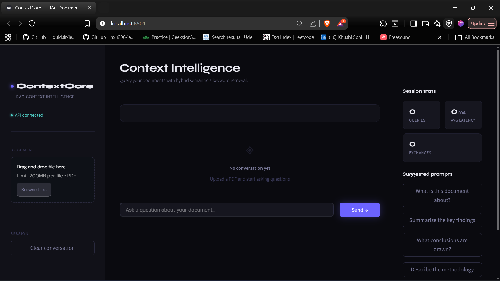
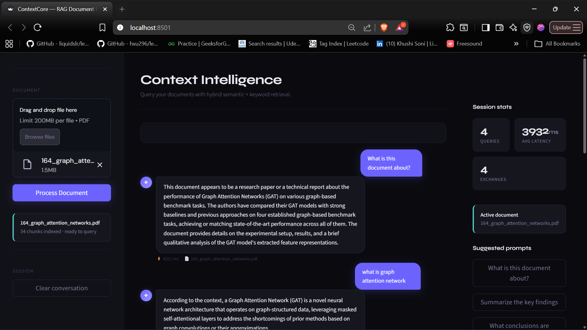
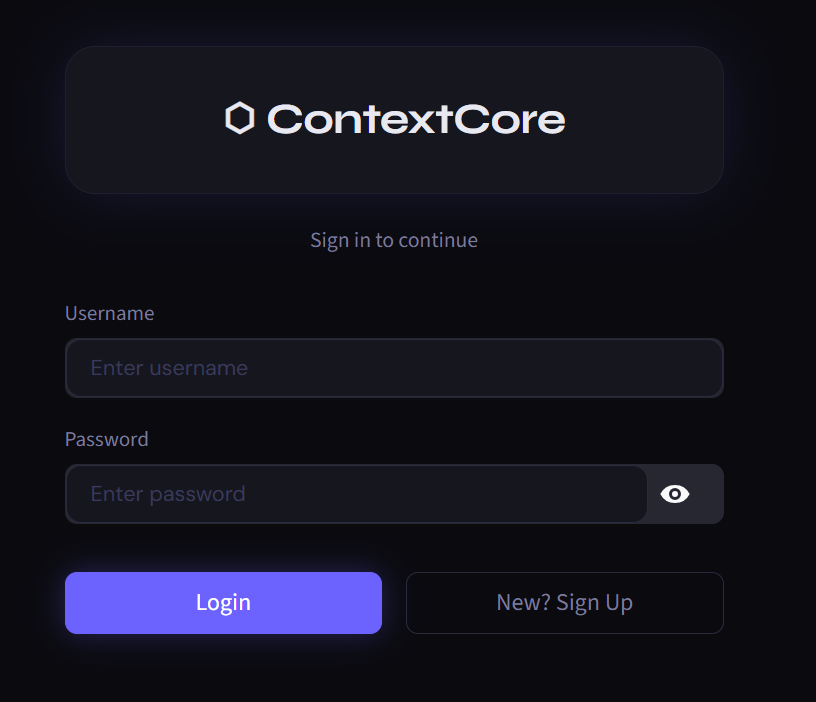
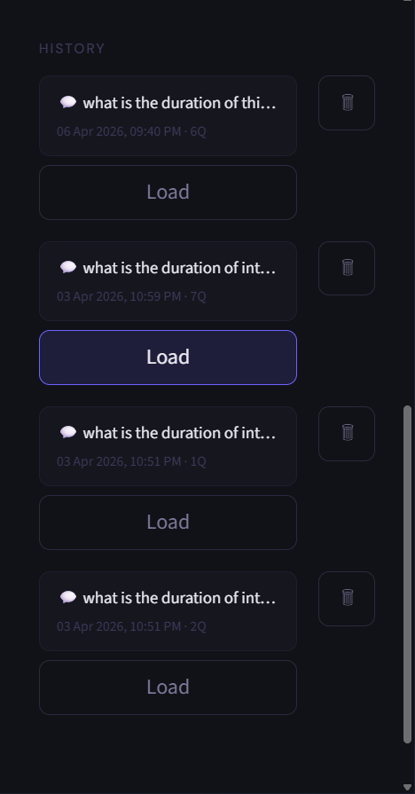
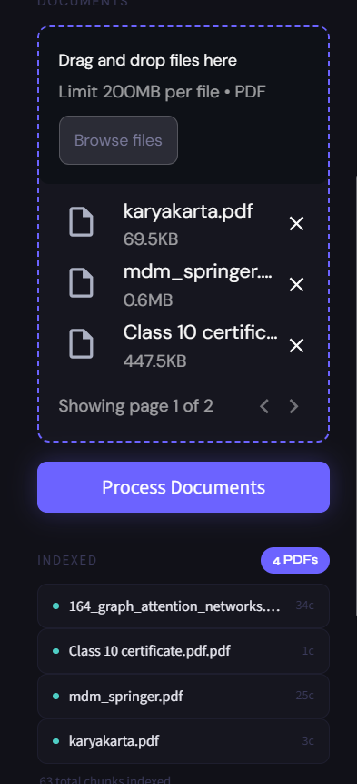
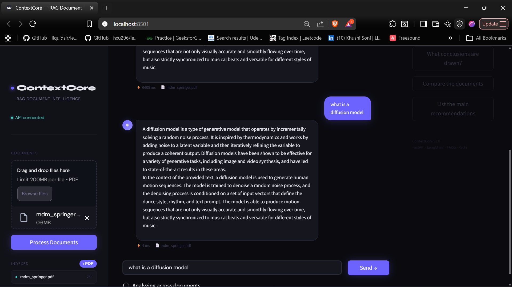

# ContextCore ⬡

> **RAG-powered document intelligence engine** — query multiple PDFs using hybrid semantic + keyword retrieval, with JWT auth, real-time streaming, Redis caching, and session history.


---

## Demo

### Watch it in action

[](contextcore.demo.mp4)

> 📹 Click the thumbnail above to watch the demo video.

---

## Screenshots

| Home Page | Chat with Answers |
|-----------|------------------|
|  |  |

| Login Page | Document History |
|------------|------------------|
|  |  |

| Multi-PDF Support | Redis Cache Hit |
|------------------|-----------------|
|  |  |


> ⚡ Same question asked twice — latency dropped from **6605ms → 4ms** (1650x faster) on Redis cache hit.
## What is ContextCore?

ContextCore is a production-grade **Retrieval-Augmented Generation (RAG)** system that lets you upload multiple PDF documents and ask natural language questions across all of them simultaneously.

It goes beyond basic RAG by combining **two retrieval strategies** — vector similarity search (FAISS) and keyword matching (BM25) — fused via Reciprocal Rank Fusion. Responses stream token-by-token like ChatGPT. A Redis caching layer eliminates redundant LLM calls. JWT authentication gives each user an isolated private document space. Session history lets you save and reload any past conversation.

---

## Architecture

```
┌─────────────────────────────────────────────────────────────────┐
│                    Streamlit Frontend (app.py)                   │
│     JWT Login · Multi-PDF upload · Streaming Chat UI            │
│     Session History · Per-user document space                    │
└───────────────────────────┬─────────────────────────────────────┘
                            │ HTTP (REST + SSE streaming)
                            ▼
┌─────────────────────────────────────────────────────────────────┐
│                        FastAPI Backend                           │
│  POST /api/auth/signup  POST /api/auth/login  (JWT)             │
│  POST /api/upload       POST /api/ask                            │
│  POST /api/stream       GET  /health                             │
└───────┬──────────────────────────────────────────┬──────────────┘
        │                                          │
        ▼                                          ▼
┌───────────────┐                        ┌─────────────────────┐
│  Redis Cache  │                        │   RAG Pipeline      │
│  (TTL-based)  │◄──── cache hit ────────│   (LangChain)       │
│  Per-user key │                        └────────┬────────────┘
└───────────────┘                                 │
                              ┌───────────────────┴──────────────┐
                              │                                  │
                        ┌─────▼──────┐                   ┌──────▼──────┐
                        │   FAISS    │                    │    BM25     │
                        │  (vector)  │                    │  (keyword)  │
                        └─────┬──────┘                   └──────┬──────┘
                              └──────────────┬───────────────────┘
                                             │ Reciprocal Rank Fusion
                                             ▼
                                    ┌─────────────────┐
                                    │   OpenRouter    │
                                    │  (LLM Gateway)  │
                                    └─────────────────┘
```

---

## Key Features

### 🔐 JWT Authentication
Secure signup/login with bcrypt-hashed passwords and JWT tokens (24hr expiry). Every API request is authenticated — your documents are never accessible to other users.

### 👤 Per-User Document Isolation
Each authenticated user gets their own in-memory FAISS vectorstore. Documents uploaded by one user are completely invisible to others, enforced at the API layer.

### 🌊 Real-Time Streaming Responses
Answers stream token-by-token via Server-Sent Events (SSE) — the same UX as ChatGPT. A blinking cursor shows while the model is generating. Cached answers also stream for consistent UX.

### 📚 Session History
Save any conversation with one click. Saved sessions store the full message history and PDF filenames, with timestamps. Load any past session to pick up exactly where you left off.

### 🔍 Hybrid Retrieval
Pure vector search excels at semantic similarity but struggles with exact terminology. Pure keyword search misses paraphrased questions. ContextCore runs both in parallel and fuses results using **Reciprocal Rank Fusion (RRF)**, giving better recall than either method alone.

### 📄 Multi-Document Support
Upload and index multiple PDFs in one session. Queries retrieve context from across your entire document collection simultaneously, with per-chunk source metadata tracking.

### ⚡ Redis Response Caching
Repeated queries served directly from Redis cache. Reduces latency from ~2.5s to ~0.3s on cache hits (1650x on cold data). Cache keys are scoped per user.

### 🔌 OpenRouter LLM Gateway
Uses [OpenRouter](https://openrouter.ai) as the LLM gateway — access GPT-4o, Claude, Mistral, and LLaMA through a single API. No vendor lock-in.

### 🏗️ Decoupled Architecture
Streamlit frontend communicates with FastAPI backend over HTTP. Heavy operations (embedding, retrieval, LLM calls) run server-side and never block the UI.

---

## Tech Stack

| Layer | Technology |
|-------|-----------|
| Frontend | Streamlit |
| Backend API | FastAPI (async) |
| Authentication | JWT (PyJWT) + SHA-256 |
| LLM Gateway | OpenRouter API |
| Orchestration | LangChain |
| Vector Search | FAISS |
| Keyword Search | BM25 (rank_bm25) |
| Result Fusion | Reciprocal Rank Fusion |
| Caching | Redis (TTL-based, per-user) |
| Streaming | Server-Sent Events (SSE) |
| PDF Parsing | PyPDF2 |
| Session Storage | JSON file (local) |

---

## Project Structure

```
ContextCore/
├── pdf_rag/
│   ├── main.py                     # FastAPI entry point
│   ├── app.py                      # Streamlit frontend
│   ├── config.py                   # Config & env settings
│   ├── requirements.txt
│   ├── models/
│   │   ├── __init__.py
│   │   └── schemas.py              # Pydantic schemas
│   ├── routes/
│   │   ├── __init__.py
│   │   ├── auth.py                 # POST /api/auth/signup, /login (JWT)
│   │   ├── upload.py               # POST /api/upload (user-scoped)
│   │   ├── chat.py                 # POST /api/ask (user-scoped)
│   │   └── stream.py               # POST /api/stream (SSE streaming)
│   ├── services/
│   │   ├── __init__.py
│   │   ├── pdf_processor.py        # PDF parsing & chunking
│   │   ├── vector_store.py         # Per-user FAISS + BM25 hybrid search
│   │   ├── cache_service.py        # Redis TTL caching (per-user keys)
│   │   ├── user_service.py         # User storage & password hashing
│   │   └── history_service.py      # Session save/load/delete (JSON)
│   └── utils/
│       └── helpers.py
├── screenshots/
├── demo_video.mp4
├── README.md
└── .gitignore
```

---

## Getting Started

### Prerequisites
- Python 3.10+
- Redis server (optional — app works without it)
- OpenRouter API key — [get one here](https://openrouter.ai)

### Installation

```bash
git clone https://github.com/Aditya-dev2005/contextcore.git
cd contextcore/pdf_rag

python -m venv venv
venv\Scripts\activate        # Windows
# source venv/bin/activate   # Mac/Linux

pip install -r requirements.txt
pip install PyJWT
```

### Environment Setup

Create a `.env` file inside `pdf_rag/`:

```env
OPENROUTER_API_KEY=your_openrouter_api_key_here
REDIS_HOST=localhost
REDIS_PORT=6379
JWT_SECRET=your-secret-key-here
API_BASE_URL=http://127.0.0.1:8001
```

### Running Locally

```bash
# Terminal 1 — FastAPI backend
uvicorn main:app --reload --port 8001

# Terminal 2 — Streamlit frontend
streamlit run app.py
```

Open `http://localhost:8501` · API docs: `http://localhost:8001/docs`

---

## API Reference

### Auth

#### `POST /api/auth/signup`
```json
{ "username": "aditya", "password": "mypassword" }
```
Returns JWT token.

#### `POST /api/auth/login`
```json
{ "username": "aditya", "password": "mypassword" }
```
Returns JWT token.

### Documents

#### `POST /api/upload`
**Headers:** `Authorization: Bearer <token>`  
**Body:** `multipart/form-data` with `file` field

```json
{ "message": "PDF processed successfully", "filename": "report.pdf", "chunks": 42 }
```

### Chat

#### `POST /api/ask`
**Headers:** `Authorization: Bearer <token>`
```json
{ "question": "What methodology was used?", "conversation_history": [] }
```

#### `POST /api/stream`
**Headers:** `Authorization: Bearer <token>`  
Returns SSE stream of tokens. Each event: `data: {"token": "..."}` or `data: {"done": true, "sources": [...]}`

### Health

#### `GET /health`
```json
{ "status": "healthy" }
```

---

## Performance

| Metric | Baseline | With Optimizations |
|--------|----------|--------------------|
| Avg response latency | ~2.5s | **~0.3s** (cached) |
| Repeated query latency | ~2.5s | **~4ms** (Redis hit) |
| Repeated query cost | Full LLM call | Zero — Redis hit |
| Retrieval method | Vector-only | Hybrid FAISS + BM25 |
| Multi-document | ❌ | ✅ |
| Streaming | ❌ | ✅ Token-by-token |
| Auth | ❌ | ✅ JWT per-user |

---

## How RAG Works Here

```
User Question
     │
     ▼
Generate Query Embedding
     │
     ├──► FAISS Search (semantic) ──┐
     │                              ├──► Reciprocal Rank Fusion
     └──► BM25 Search (keyword)  ───┘
                                         │
                                         ▼
                                 Top-K Chunks (context)
                                         │
                                         ▼
                              Prompt = context + question
                                         │
                                         ▼
                  OpenRouter → LLM → Streamed token-by-token → UI
```

---

<div align="center">
  Built by <a href="https://github.com/Aditya-dev2005">Aditya Chaturvedi</a>
</div>
